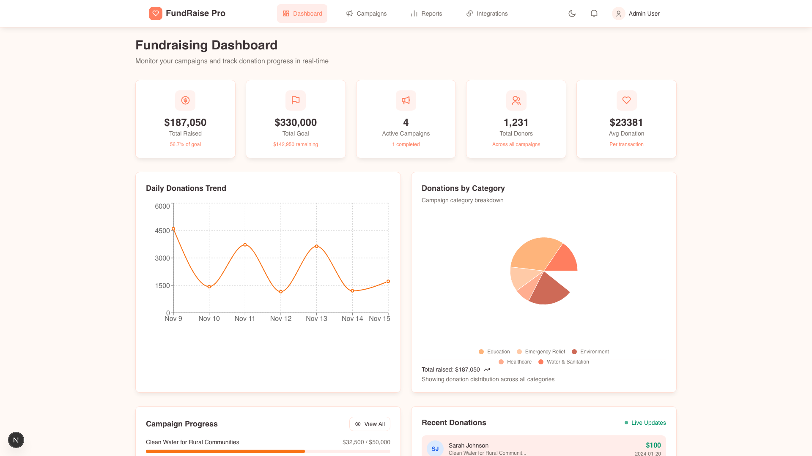
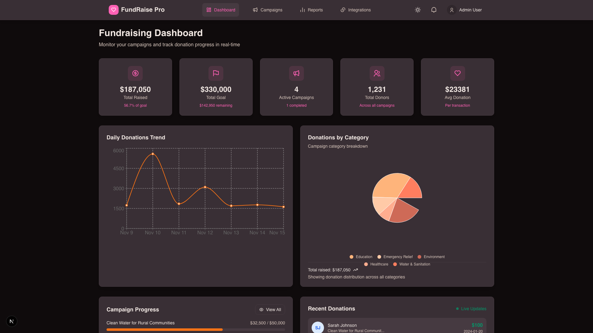
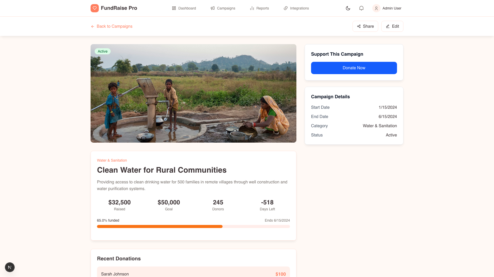
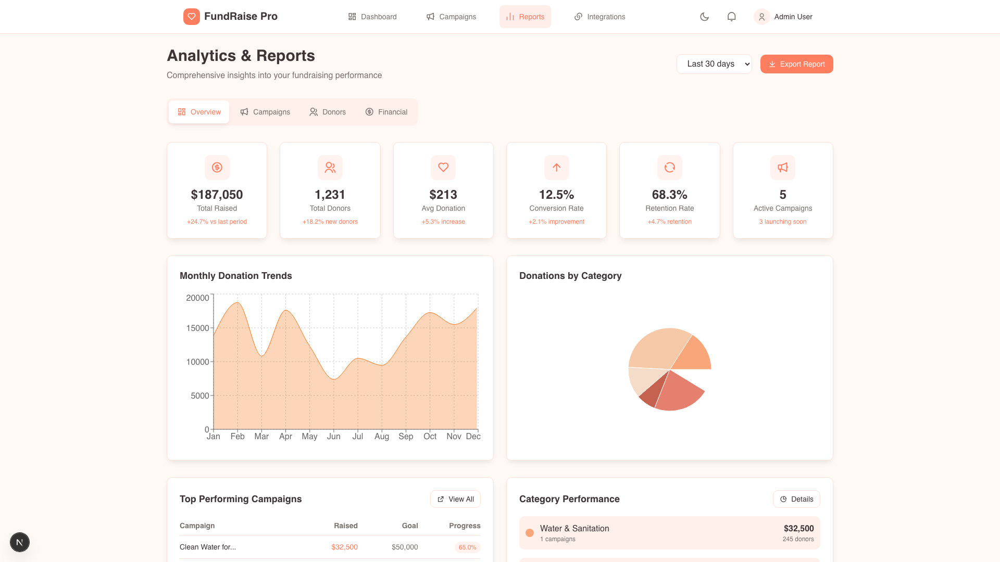
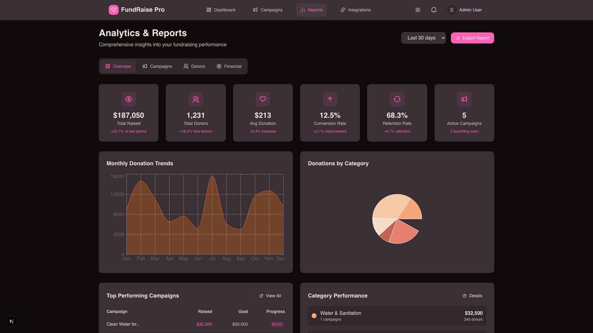
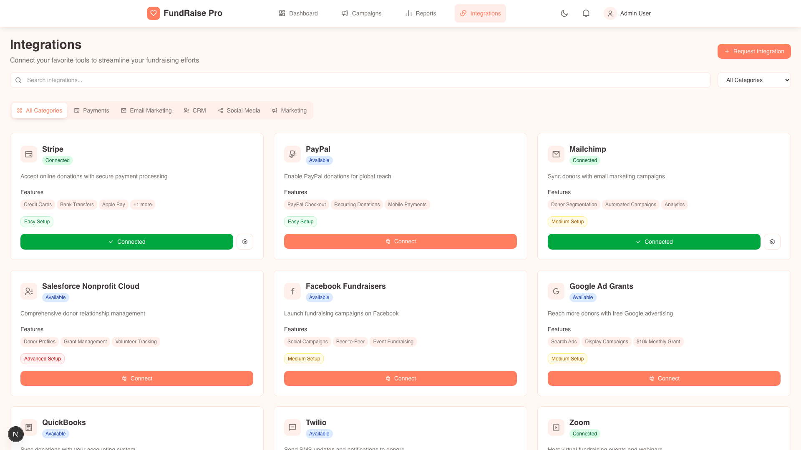
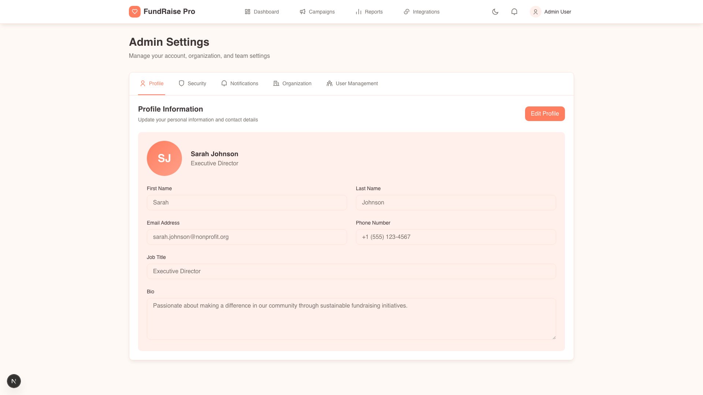

# FundRaise Pro 🎯

> A modern, full-featured fundraising campaign management platform built with Next.js 16 and React 19.

[](https://nextjs.org/)
[](https://reactjs.org/)
[](https://www.typescriptlang.org/)
[](https://tailwindcss.com/)

FundRaise Pro is a comprehensive fundraising campaign management application that enables nonprofit organizations to create, monitor, and manage their fundraising campaigns with ease. Built with modern web technologies and featuring a beautiful, responsive design system with both light and dark modes.

## ✨ Features

- **📊 Real-time Dashboard** - Monitor campaign performance with live donation tracking and analytics
- **🎯 Campaign Management** - Create, edit, and manage multiple fundraising campaigns
- **📈 Advanced Analytics** - Comprehensive reporting with interactive charts and visualizations
- **🔗 Integrations** - Connect with popular payment processors and fundraising platforms
- **⚙️ Settings & Configuration** - Manage organization details, security, and user preferences
- **🌓 Dark Mode** - Beautiful light and dark themes with seamless switching
- **📱 Responsive Design** - Works perfectly on desktop, tablet, and mobile devices
- **🎨 Customizable Theme** - Centralized theme configuration for easy branding

## 🖼️ Screenshots

### Dashboard
The main dashboard provides a comprehensive overview of your fundraising activities with real-time KPIs, donation trends, and campaign progress.


*Dashboard in Light Mode - Real-time analytics and KPIs*


*Dashboard in Dark Mode - Easy on the eyes for extended use*

### Campaign Management
Easily create, view, and manage all your fundraising campaigns in one place.


*Campaign listing with filtering and search capabilities*


*Detailed campaign view with donation tracking and progress metrics*

### Analytics & Reports
Gain deep insights into your fundraising performance with comprehensive analytics.


*Advanced reporting with multiple chart types and data visualizations*


*Reports in Dark Mode - Theme-aware charts and visualizations*

### Integrations
Connect with popular payment processors and fundraising platforms.


*Integration marketplace with one-click setup*

### Settings
Manage your organization profile, security settings, and user preferences.


*Comprehensive settings panel for organization management*

## 🚀 Getting Started

### Prerequisites

- **Node.js** 18.0 or higher
- **npm** or **yarn** package manager

### Installation

1. **Clone the repository**
   ```bash
   git clone https://github.com/yourusername/fundraise-pro.git
   cd fundraise-pro
   ```

2. **Install dependencies**
   ```bash
   npm install
   ```

3. **Run the development server**
   ```bash
   npm run dev
   ```

4. **Open your browser**

   Navigate to [http://localhost:3000](http://localhost:3000) to see the application.

### Build for Production

```bash
# Create production build
npm run build

# Start production server
npm start
```

### Run Tests

```bash
# Run Playwright tests
npx playwright test

# Run tests in UI mode
npx playwright test --ui

# Run tests in specific browser
npx playwright test --project=chromium
```

## 🏗️ Tech Stack

### Core Framework
- **Next.js 16** - React framework with App Router
- **React 19** - UI library
- **TypeScript** - Type safety and better developer experience

### Styling
- **Tailwind CSS v4** - Utility-first CSS framework
- **shadcn/ui** - High-quality, accessible UI components
- **OKLCH Color Space** - Modern color system for better perceptual uniformity

### Data Visualization
- **Recharts** - Composable charting library built on React components

### Icons & Fonts
- **RemixIcon** - Open-source icon system
- **Montserrat** - Primary sans-serif font
- **Merriweather** - Serif font for headings
- **Ubuntu Mono** - Monospace font for code

### Testing
- **Playwright** - End-to-end testing framework

## 📁 Project Structure

```
fundraise-pro/
├── app/                      # Next.js App Router pages
│   ├── campaigns/           # Campaign management pages
│   │   └── [id]/           # Dynamic campaign detail
│   ├── dashboard/          # Main dashboard
│   ├── integrations/       # Third-party integrations
│   ├── reports/            # Analytics and reporting
│   ├── settings/           # User settings
│   │   └── components/    # Settings sub-components
│   ├── layout.tsx          # Root layout
│   └── globals.css         # Global styles and theme
├── components/
│   ├── base/               # Reusable base components (Button, Card)
│   ├── feature/            # Feature-specific components (Navbar)
│   ├── ui/                 # shadcn/ui components
│   └── theme-provider.tsx  # Theme context provider
├── lib/
│   ├── mocks.ts            # Mock data for campaigns and donations
│   ├── theme-config.ts     # Centralized theme configuration
│   ├── theme-generator.ts  # Theme utility functions
│   └── utils.ts            # Utility functions
├── scripts/
│   └── capture-screenshots.mjs  # Playwright screenshot script
└── docs/
    └── screenshots/        # Application screenshots
```

## 🎨 Theme Customization

The entire application's design can be customized by editing hex codes in one file: `lib/theme-config.ts`

This file controls:
- All colors (light mode and dark mode)
- Gradients
- Border radius
- Shadows
- Typography
- Component-specific colors (buttons, cards, KPIs, charts, etc.)

**Quick start to change theme:**
1. Open `lib/theme-config.ts`
2. Update hex codes in the `themeConfig` object
3. Save - changes apply automatically in dev mode

For detailed theme customization, see:
- `THEME_GUIDE.md` - Complete documentation with examples
- `THEME_QUICK_REFERENCE.md` - Common changes and pre-made schemes

## 🌓 Dark Mode

The application features a comprehensive dark mode that can be toggled via the moon/sun icon in the navigation bar. The theme preference is saved in browser localStorage and persists across sessions.

Both light and dark themes use the OKLCH color space for better perceptual uniformity and accessibility.

## 📊 Key Features Explained

### Real-time Dashboard
- **Live KPI Cards** - Track total raised, goals, active campaigns, donors, and average donations
- **Interactive Charts** - Daily donation trends with area charts
- **Category Breakdown** - Pie chart visualization of donations by category
- **Campaign Progress** - Real-time progress bars for active campaigns
- **Live Donation Feed** - Simulated real-time donation updates every 10 seconds

### Campaign Management
- **Campaign CRUD** - Create, read, update, and delete campaigns
- **Advanced Filtering** - Filter by status (active, completed, paused)
- **Search Functionality** - Search campaigns by title or category
- **Campaign Details** - Detailed view with donation history and analytics
- **Progress Tracking** - Visual progress bars and completion percentages

### Analytics & Reports
- **Multiple Report Types** - Overview, Campaigns, Donors, and Financial reports
- **Interactive Visualizations** - Area charts, bar charts, pie charts, and line graphs
- **Date Range Selection** - Filter data by 7, 30, 90 days, or 1 year
- **Export Functionality** - Export reports as JSON for external analysis
- **Category Performance** - Track performance across different campaign categories

### Integrations
- **Payment Processors** - Stripe, PayPal, Square integrations
- **Fundraising Platforms** - GoFundMe, Kickstarter, Patreon
- **Email Marketing** - Mailchimp, SendGrid, Constant Contact
- **CRM Systems** - Salesforce, HubSpot
- **One-click Setup** - Easy integration management with status indicators

### Settings
- **Profile Management** - Update user profile and contact information
- **Organization Settings** - Manage organization details and tax-exempt status
- **Security** - Password management, 2FA, and active session monitoring
- **Notifications** - Customize email and push notification preferences
- **User Management** - Add and manage team members with role-based access

## 🔄 Data Management

Currently, the application uses mock data for demonstration purposes. All data is stored in `lib/mocks.ts`:

- **mockCampaigns** - Sample fundraising campaigns with various statuses
- **mockDonations** - Sample donation records

### Future Backend Integration

When integrating with a real backend:
1. Replace imports from `lib/mocks.ts` with API calls
2. Consider using React Server Components for data fetching
3. Update `dynamic = 'force-dynamic'` pages with proper data fetching strategies
4. Replace `setInterval` simulation in Dashboard with WebSocket or Server-Sent Events

## 🧪 Testing

The project includes Playwright for end-to-end testing:

```bash
# Run all tests
npx playwright test

# Run tests in UI mode (interactive)
npx playwright test --ui

# Run tests in specific browser
npx playwright test --project=chromium

# Run specific test file
npx playwright test tests/dashboard.spec.ts
```

Chromium browser is pre-installed for Playwright testing.

## 📝 Scripts

```json
{
  "dev": "next dev",              // Start development server
  "build": "next build",          // Build for production
  "start": "next start",          // Start production server
  "lint": "next lint"             // Run ESLint
}
```

## 🤝 Contributing

Contributions are welcome! Please feel free to submit a Pull Request.

1. Fork the repository
2. Create your feature branch (`git checkout -b feature/AmazingFeature`)
3. Commit your changes (`git commit -m 'Add some AmazingFeature'`)
4. Push to the branch (`git push origin feature/AmazingFeature`)
5. Open a Pull Request

## 📄 License

This project is licensed under the MIT License - see the LICENSE file for details.

## 🙏 Acknowledgments

- [Next.js](https://nextjs.org/) - The React framework for production
- [shadcn/ui](https://ui.shadcn.com/) - Beautiful, accessible UI components
- [Tailwind CSS](https://tailwindcss.com/) - Utility-first CSS framework
- [Recharts](https://recharts.org/) - Composable charting library
- [RemixIcon](https://remixicon.com/) - Open-source icon system
- [Playwright](https://playwright.dev/) - End-to-end testing framework

## 📧 Contact

For questions or support, please open an issue in the GitHub repository.

---

**Built with ❤️ using Next.js 16 and React 19**
